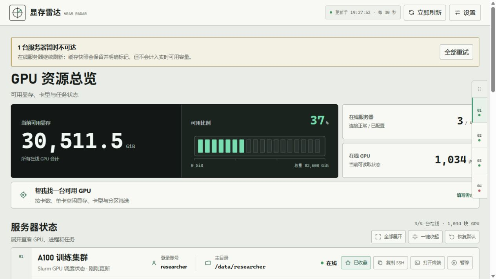
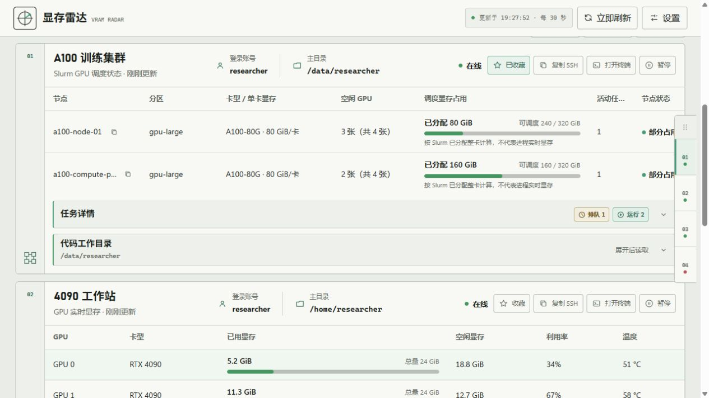

<p align="center">
  <strong>English</strong> · <a href="README.zh-CN.md">简体中文</a>
</p>

<p align="center">
  
</p>

<h1 align="center">VRAM Radar</h1>

<p align="center">
  <strong>One local desktop workspace for GPU capacity scattered across SSH hosts and Slurm clusters.</strong>
</p>

<p align="center">
  Windows and macOS · Direct SSH and Slurm · Local-first · Your server configuration stays on your computer
</p>

<p align="center">
  
  
  
</p>

<p align="center">
  <a href="../../releases/latest"><strong>Download the stable release</strong></a>
  · <a href="#get-started-in-3-minutes">Quick start</a>
  · <a href="#what-it-does">Features</a>
  · <a href="docs/server-config-discovery.md">SSH discovery guide</a>
</p>



## Stop switching terminals just to find an available GPU

Still logging into servers one by one, running `nvidia-smi`, `nvtop`, and `squeue`, then manually comparing which GPU is actually usable?

VRAM Radar is a local desktop monitor for personal workstations, lab servers, and Slurm clusters. It starts from the SSH configuration already on your computer and brings free VRAM, GPU model, partition, node, your current jobs, and connection health into one interface. The first screen stays focused; deeper information appears only when you ask for it.

VRAM Radar does not submit jobs, reserve GPUs, or replace your scheduler. It solves the earlier, more frequent decision: **where capacity is available, where your work is running, and which server you should open next.**

| Common pain point | How VRAM Radar helps |
|---|---|
| Resource information is scattered across SSH terminals | Compare Direct SSH and Slurm resources in one desktop view |
| SSH configuration lives in several systems, editors, and tools | Discover common OpenSSH, VS Code, Cursor, Windsurf, Colima, and OrbStack paths |
| GPU model, partition, memory, and jobs must be cross-checked manually | Keep decision-relevant facts together and match suitable capacity on demand |
| Large fleets or GPU clusters make dashboards slow | Bound the main list, navigator, remote output, concurrency, and node pagination |
| You only want to know where your own jobs are running | The navigator's Tasks filter includes only activity owned by the current login account |

## Preview

These real application renders use synthetic server data. They contain no private hostnames, keys, or local Profiles.

### Compare multiple servers at a glance

The top of the page leads with total available VRAM and online capacity. Each server header keeps account, home directory, status, favorite, copy SSH, open terminal, and pause controls on one information rail. The Mini Navigator on the edge provides fast fleet-wide movement.

### Expand nodes, tasks, and directories only when needed



The A100/Slurm node table uses fixed column tracks, so longer node names, partitions, or states do not misalign one server from another. Task details and the code working directory begin collapsed, expand only on demand, and can all be collapsed again with one action.

## What it does

### Multi-server GPU overview

- Collect Direct SSH `nvidia-smi` and Slurm scheduler snapshots in the same application.
- Summarize online servers, GPU count, total VRAM, and available VRAM.
- Distinguish online, offline, cached, authentication, host-key, and configuration states.
- Show per-device memory, utilization, temperature, and GPU processes for Direct SSH; show nodes, partitions, GPU models, scheduler memory, and jobs for Slurm.

### Find capacity that actually fits

- Match by GPU count, minimum free memory per GPU, GPU model, and partition.
- Require multiple GPUs to be on the same node when the workload needs it.
- Keep recommendations hidden until you run a query, then emphasize server, node or device, model, partition, and available count.
- Save common matching views and receive a one-shot local notification when a saved condition becomes available.

### Built for large fleets and clusters

- Keep the Mini Navigator collapsed by default and expand it on pointer hover or keyboard focus.
- Search and filter by favorites, recent servers, available capacity, your jobs, or attention state.
- Drag the navigator between the left and right edges; the preference survives restarts and application updates.
- Render at most 50 server cards per main page and 80 navigator items per window.
- For Slurm clusters above 64 nodes or 256 GPUs, show model, partition, and capacity summaries before loading 75 node rows at a time.

### Start from existing SSH configuration

- Run local discovery during first-use setup instead of starting with an empty form.
- Use the same bounded discovery, merge, and de-duplication path on Windows and macOS.
- Read local configuration without connecting merely because a `Host` entry was found.
- Remember imported SSH aliases that you explicitly remove. Later startup and synchronization skip those aliases while still discovering newly added `Host` entries; adding an alias back manually clears the ignore record.
- OpenSSH import retains only server ID, backend type, alias, and source-config reference. It does not copy usernames, `IdentityFile` values, private keys, or credentials; no local Profile, server address, or user data enters a public package.
- When discovery finds nothing, show platform-specific paths, commands, and copy buttons in the built-in guide.
- For any saved server, open the per-server SSH Key guide to reuse an existing key or generate a dedicated Ed25519 key, deploy only its public half, verify the selected identity, and roll back a failed installation.

### Accounts, jobs, and code directories

- Show the current login account together with its home-directory location.
- In the Mini Navigator, show job information only when the current account has a running or queued job on that server.
- Keep full task detail available in progressively disclosed “mine”, “other users”, and “recent results” views.
- Open the inferred code working directory by default, or pin any browsed directory as a persistent default.
- Bound directory depth and entry count, never read file contents, and never follow symbolic links.

### Desktop conveniences

- Favorite a server, copy its SSH command, open the system terminal, or pause that server's monitoring. **Copy SSH** includes a statically provable `HostName`, `User`, and `Port` while preserving the owning `-F` configuration and alias; conditional or dynamic configurations fall back to the safe alias command with a clear warning instead of guessed connection details.
- On Windows, minimize or close to the notification area; its menu exposes status, show, refresh, settings, pause, and exit actions.
- Check the latest stable GitHub Release after startup and notify only—never silently download or install code.
- Keep a version-independent Windows installation path, so an in-place upgrade preserves the Start-menu or desktop shortcut.
- Copy strictly redacted diagnostics and open the local log directory when troubleshooting a connection.

## How it complements `nvidia-smi` and `nvtop`

VRAM Radar is not a replacement for terminal diagnostics. `nvidia-smi` and `nvtop` remain excellent for inspecting the host you are already using; VRAM Radar helps you choose the host before you connect.

| Scenario | `nvidia-smi` / `nvtop` | VRAM Radar |
|---|---|---|
| Deep inspection of the current host | Excellent fit | Key metrics and overview |
| Compare several SSH servers | Usually run on each host | One unified view |
| Slurm nodes, partitions, and your jobs | Requires additional commands | Presented alongside GPU capacity |
| First-time setup | You organize the SSH commands | Local discovery with a review step |
| Thousand-GPU navigation | Requires custom scripting | Summary-first, bounded, paginated, on-demand views |
| Job submission and GPU reservation | Not responsible | Not responsible; continue using Slurm or your existing platform |

## Get started in 3 minutes

1. Download the package for your platform from the [Latest Release](../../releases/latest).
2. Start VRAM Radar. An empty Profile opens a three-step setup flow instead of an empty dashboard.
3. Choose automatic discovery, review the SSH aliases it found, and confirm whether each server uses Direct SSH or Slurm.
4. If you need password authentication, enter the server login password in Local Settings. You can then keep password login or use the per-server SSH Key guide to configure and verify passwordless access.
5. Save the Profile and open the resource overview. Advanced details, tasks, and directories remain on demand.

Server states are evidence-based: **discovered** means a local entry was parsed, **saved** means its Profile transaction completed, **verifying** means the saved SSH path is running, and **monitoring ready** means authentication, backend commands, and response parsing all succeeded. Imported or saved servers are never counted as live capacity until that last step passes; stale snapshots remain visible only as clearly marked history.

### Windows

Download `VRAMRadar-Setup-0.7.0.exe`. This is the recommended download. The installer uses a stable per-user application path, so the normal installation does not request administrator permission and in-place upgrades preserve the Start-menu or desktop shortcut. A custom drive is supported through a user-writable folder such as `D:\Apps\VRAM Radar`; use administrator mode only for protected locations such as `Program Files`. The public Release no longer offers a Windows portable ZIP.

The current package has no Authenticode publisher certificate. If Windows shows SmartScreen, first confirm that the file came from this repository's Latest Release, then choose **More info → Run anyway**. A managed PC may block unsigned software without an override; in that case, ask its administrator rather than weakening system protection.

### macOS

Download `VRAMRadar-0.7.0-macos.zip`:

- `VRAM Radar (Apple Silicon).app` supports M1, M2, M3, and M4 Macs, with a current validation boundary of macOS 14 or newer.
- `VRAM Radar (Intel).app` supports Intel x86_64 Macs, with a current validation boundary of macOS 15 or newer.

This release is not signed with an Apple Developer ID and is not notarized because no Apple distribution credentials are configured for the project. After extracting the archive, use Finder's right-click **Open** action on the matching `.app`, then confirm **Open** once. Do not disable Gatekeeper globally.

> The current public stable release is `v0.7.0`. Update checks start independently of server refresh, retry visibly after a network failure, and repeat while the app remains open. Windows installer copies now support a confirmed, SHA-256-verified update with rollback and automatic restart. GitHub exposes only the two files users need to download: the Windows installer and the combined macOS archive.

This installer-enabled release adds a confirmed one-click Windows update path:
it accepts only the exact official Release asset, verifies GitHub's
SHA-256 digest, preserves the previous installation for rollback, and restarts
the same executable path after success. Because `v0.6.1` does not yet contain
the independent updater, installing that first updater-enabled version is a
one-time manual bootstrap. On macOS, the app downloads and verifies the archive
but asks the user to replace the `.app` manually until Developer ID signing and
notarization are available.

## Automatic configuration coverage

<details>
<summary><strong>Windows and macOS discovery sources</strong></summary>

VRAM Radar scans and merges the following local sources in deterministic priority order:

- Version 2 `servers.toml`, including portable Harness layouts such as `harness/config/servers.toml`.
- User, XDG, system, Homebrew, and installed OpenSSH-client `config` locations.
- Bounded OpenSSH `Include` fragments with cycle protection and Windows backslash handling.
- `remote.SSH.configFile` from VS Code, VS Code Insiders, Cursor, VSCodium, and Windsurf.
- Colima, OrbStack, and other maintained standalone-tool paths.
- Editor paths using `~`, `${userHome}`, `${env:NAME}`, and normal operating-system environment syntax.

Only concrete `Host` aliases are imported; wildcard rules and `known_hosts` are skipped. Each alias retains its original OpenSSH source and uses it through `ssh -F`, so an editor-specific or XDG configuration does not need to be copied into `~/.ssh/config`. `HostName`, `User`, `Port`, `IdentityFile`, `ProxyJump`, and `ProxyCommand` remain owned by that local file and are resolved by OpenSSH at connection time instead of being duplicated into the app Profile.

Removing an imported server creates a local, case-insensitive ignore record for its alias. Automatic synchronization will not resurrect that alias, but it continues to discover other aliases added to the SSH configuration. Manually adding the same alias again is an explicit restore and removes the ignore record.

OpenSSH cannot identify whether an alias represents Direct SSH or Slurm. New aliases therefore preview as Direct SSH, while later synchronization preserves the backend choice you reviewed.

If no source is found, follow the [Windows and macOS SSH configuration discovery guide](docs/server-config-discovery.md).

</details>

## Authentication and local-data security

<details>
<summary><strong>Passwords, keys, and Profile boundaries</strong></summary>

- By default, VRAM Radar uses the installed OpenSSH client, aliases, ssh-agent, or a private key selected by the user.
- Server account passwords are stored only in Windows Credential Manager or macOS Keychain.
- A Profile stores a non-secret reference; passwords never enter the Profile, Git, logs, command-line arguments, or child-process environment.
- The packaged one-time askpass helper obtains a password through an authenticated private loopback exchange.
- Before the SSH Key guide is completed, a saved password selects password authentication for that server. After a key is verified, the selected identity is tried first and the OS-stored password remains a local auth-failure fallback.
- The SSH Key guide never overwrites an existing local key. It sends only a validated public key over SSH stdin, rejects unsafe remote `.ssh` / `authorized_keys` ownership or file types, prevents duplicate entries, and verifies with `IdentitiesOnly=yes` before saving.
- A generated app-specific Ed25519 private key stays under the current user's application configuration directory with restricted permissions. It is intentionally passphrase-free for unattended monitoring; users who require a passphrase should select an existing key and load it through ssh-agent.
- Verify a server's Host Key outside the app before first use. A changed Host Key is treated as a security error and is not retried automatically.
- Profiles, server catalogs, caches, logs, locks, and credentials remain on the current user's computer and never enter the public installer or archive.

</details>

## Download, update, and platform boundaries

| Item | Windows | macOS |
|---|---|---|
| Stable download | x64 installer | One ZIP containing native Apple Silicon and Intel `.app` bundles |
| Credential store | Windows Credential Manager | macOS Keychain |
| Desktop runtime | WebView2 / native window | Cocoa / WebKit |
| Shortcut after update | Stable install path; verified one-click upgrade after the bootstrap release | Replace the `.app` manually |
| Current signing claim | Unsigned; per-user install avoids UAC | Unsigned and unnotarized; one Finder confirmation required |
| Update behavior | Check and notify; never auto-install | Check and notify; never auto-install |

More detail:

- [Windows installation, notification area, and shortcut updates](docs/windows-install-and-update.md)
- [macOS builds, architectures, and validation boundary](docs/macos-desktop.md)
- [v0.7.0 release notes](docs/release-notes-v0.7.0.md)

## Frequently asked questions

<details>
<summary><strong>Can I sign in with a password if I have no public/private key pair?</strong></summary>

Yes. Enter the server login password in Local Settings. The operating-system credential store protects it; it is never written to the project or a public package.

</details>

<details>
<summary><strong>Why must I confirm Direct SSH or Slurm after discovery?</strong></summary>

OpenSSH configuration describes how to connect, not whether the remote system uses Slurm. VRAM Radar therefore creates a safe local preview and asks you to confirm the collection backend.

</details>

<details>
<summary><strong>What if I have many servers or a cluster with thousands of GPUs?</strong></summary>

Large-scale paths do not render or read everything at once. The fleet, navigator, and node details use separate bounded pages or windows; each remote output is capped at 8 MiB, with at most eight concurrent collectors.

</details>

<details>
<summary><strong>Will VRAM Radar reserve a GPU or submit a job for me?</strong></summary>

No. VRAM Radar is currently a local monitoring and selection aid. Submission, reservation, and site policy remain with Slurm or your existing platform.

</details>

## Documentation

| Document | Purpose |
|---|---|
| [SSH configuration discovery](docs/server-config-discovery.md) | Windows and macOS recovery steps when automatic discovery finds nothing |
| [Interface design system](docs/design-system.md) | Information hierarchy, typography, cards, SVG, and interaction principles |
| [Productization design](docs/productization-design.md) | Product boundary and cross-platform desktop architecture |
| [Windows installation and updates](docs/windows-install-and-update.md) | Installer, shortcut, and notification-area lifecycle |
| [macOS desktop](docs/macos-desktop.md) | Cocoa bundle, Apple Silicon / Intel, and validation path |

## Development and validation

<details>
<summary><strong>Maintainer commands</strong></summary>

Windows:

```powershell
uv sync --extra build --frozen
.\.venv\Scripts\python.exe -m unittest discover -s tests -v
node --check src\vram_radar\web\app.js
.\Build-VramRadar.ps1 -SkipSync
.\.venv\Scripts\python.exe tools\validate_packaged_askpass.py
.\.venv\Scripts\python.exe tools\validate_packaged_tray.py
.\Build-VramRadar-Installer.ps1 -SkipBundle
```

macOS:

```bash
uv sync --extra build --frozen
./.venv/bin/python -m unittest discover -s tests -v
node --check src/vram_radar/web/app.js
bash Build-VramRadar-macOS.sh --skip-sync
./.venv/bin/python tools/validate_macos_bundle.py
```

The macOS build uses the active Python architecture by default. Use `--target-arch=arm64`, `--target-arch=x86_64`, or `--target-arch=universal2` only when Python and every native dependency contain that target architecture.

Run from source with an explicitly selected local home:

```powershell
.\.venv\Scripts\python.exe -m vram_radar --home <local-profile-root> --profile <profile-id>
```

Release validation must use an empty temporary Profile with `--no-auto-import`, so maintainer server configuration is never contacted.

</details>

## Feedback and contributions

If automatic discovery misses an SSH configuration source, or the app fails to launch on a Windows or macOS environment, open an [Issue](../../issues) with the operating-system version, application version, and the app's **redacted diagnostics**. Never upload passwords, private keys, real server addresses, or an unreviewed full log.

VRAM Radar is not another infrastructure platform. Its goal is simpler: fewer terminal switches and a faster path to the next usable GPU.
