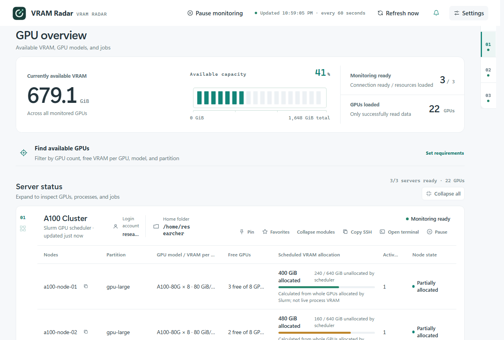
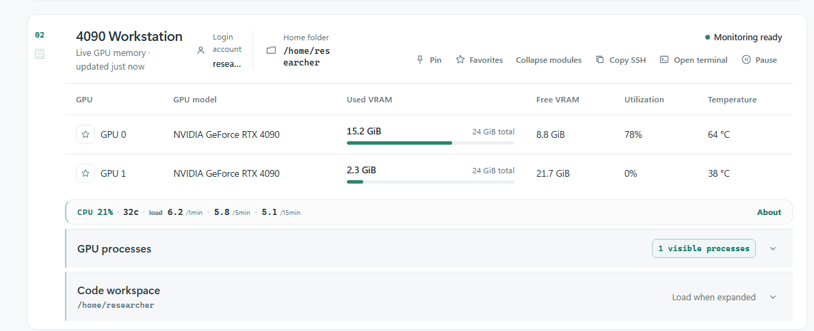
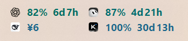
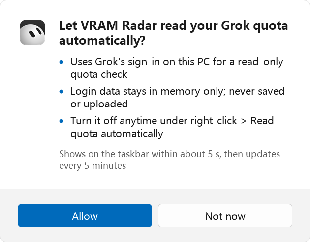
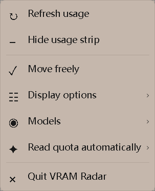

<p align="center">
  <strong>English</strong> · <a href="README.zh-CN.md">Chinese (Simplified)</a>
</p>

<p align="center">
  
</p>

<h1 align="center">VRAM Radar</h1>

<p align="center">
  <strong>GPU capacity across SSH hosts and Slurm clusters, plus AI app quota on the taskbar.</strong>
</p>

<p align="center">
  
  
  
  
  
</p>

<p align="center">
  <a href="../../releases/latest"><strong>Download v1.0.0</strong></a>
  · <a href="#installation">Installation</a>
  · <a href="#usage">Usage</a>
  · <a href="#troubleshooting">Troubleshooting</a>
  · <a href="docs/release-notes-v1.0.0.md">Changelog</a>
</p>



VRAM Radar is a local, read-only desktop monitor. It shows available VRAM, GPU
utilization, jobs and connection state for Direct SSH servers, Slurm clusters and
the local NVIDIA GPU. An optional taskbar strip (Windows) or menu-bar item (macOS)
shows the remaining quota and reset time of AI coding apps.

It is not a scheduler: it does not submit jobs, reserve GPUs, or replace
`nvidia-smi`, `nvtop` or Slurm.

## Features

### GPU monitoring

| Capability | Description |
|---|---|
| Multiple servers | Direct SSH workstations, Slurm clusters and this computer's **Local GPU** (NVIDIA through NVML or `nvidia-smi`; on Windows also AMD and Intel through performance counters) in one view, with search, filters, favorites and per-server pause. |
| Per-GPU detail | Used and free VRAM, utilization and temperature where the backend provides them; Slurm partitions, node state and scheduled allocation. |
| Jobs and processes | Running and queued Slurm jobs and Direct SSH GPU processes for your account, with GPU allocation and available timing metadata. |
| Notifications | Native alerts for task completion and for favorite servers or GPUs that become idle or reach a free-memory threshold, with unread history in the notification center. |
| Host context | CPU usage, load averages, core count, host memory, and on-demand browsing of working directories. |
| SSH discovery | Reads local OpenSSH, VS Code, Cursor, Windsurf, Colima, OrbStack and XDG locations. Discovery is local; a server counts as **monitoring ready** only after a successful connection. |



### AI quota strip (Windows taskbar, macOS menu bar)



- On Windows, a compact strip sits on the taskbar to the right of the Widgets
  (weather) button, follows the weather widget's visible width, and samples the
  taskbar colour so it blends in.
- Up to **4** apps at a time (Windows). Codex, Grok and Kimi show the remaining
  quota and the time until reset; DeepSeek shows its wallet balance. Claude, GLM,
  Qwen and Tencent Yuanbao show install and sign-in status only (they keep no
  readable local usage data). Codex is selected by default; installed apps are
  detected locally.
- Labels can be app **Icons** or **Text** names:

  

- Codex quota comes from the locally installed Codex `app-server`, using its own
  ChatGPT sign-in. DeepSeek shows the wallet balance through a read-only query.
- **Read quota automatically** (Grok, Kimi) is off until you allow it in a
  consent dialog. It reuses the app's existing sign-in for one read-only quota
  request; login data is decrypted in memory only and never saved, logged or
  uploaded. Values refresh every 5 minutes.

  

- Hover the strip for a compact detail card (icons, full names, quota or balance, reset time, and last update); it does not take focus or start extra polling. Click the row of an app detected on this computer to open it, or to bring its window to the front if it is already running; the row is highlighted under the pointer.
- On macOS, the menu-bar item shows the Codex quota and reset countdowns, with a
  menu for details, usage settings, refresh, turning the display off and quitting.

### General

- Bilingual interface (Simplified Chinese and English); the first run follows the
  system language and can be changed under **Settings → Interface language**.
- Update checks against GitHub Releases. Nothing installs in the background:
  on Windows, **Safe one-click update** runs after you confirm it, checks the
  installer's SHA-256 digest and size, installs silently and restores the
  previous version if installation fails; on macOS the verified zip is revealed
  in Finder. A release rebuilt under the same version number from a newer
  commit is offered as a repair update.

## Installation

Download from the [latest release](../../releases/latest).

| Platform | File | Notes |
|---|---|---|
| Windows x64 | `VRAMRadar-Setup-1.0.0.exe` | Per-user installer, no administrator rights. The installer is not code-signed, so SmartScreen may show "Windows protected your PC"; choose **More info → Run anyway** after verifying the file. |
| macOS | `VRAMRadar-1.0.0-macos.zip` | Contains `VRAM Radar (Apple Silicon).app` (arm64, macOS 14+) and `VRAM Radar (Intel).app` (x86_64, macOS 15+). Unsigned and unnotarized; see below. |

The latest release contains exactly the two files users need to download. On
Windows, the installer is the recommended download: it preserves the Start-menu
or desktop shortcut across in-place updates, and the public Release no longer
offers a Windows portable ZIP.
This release is not signed with an Apple Developer ID and is not notarized;
on first launch, right-click **Open** in Finder instead of disabling Gatekeeper.

Do not disable SmartScreen or Gatekeeper globally. See
[Windows installation and updates](docs/windows-install-and-update.md),
[Windows signing status](docs/windows-code-signing.md) and
[macOS notes](docs/macos-desktop.md).

## Usage

1. Start VRAM Radar and review the SSH aliases it finds.
2. Confirm whether each server uses Direct SSH or Slurm, save, and open the
   resource view. To monitor this computer, add a server and choose
   **Local GPU (NVIDIA / AMD / Intel)** as the connection type.
3. In **Settings**, choose task-completion and favorite-GPU alerts.
4. To show AI quota, open **Settings → Extensions** and turn on **Quota monitoring**. It is the single on/off switch for all AI apps; choose which apps appear from the strip's right-click menu.

### Taskbar strip

- **Click**: open the GPU overview window.
- **Double-click**: open the quota monitoring switch in Settings.
- **Right-click** menu:



| Menu item | Effect |
|---|---|
| Refresh usage | Re-read all selected apps now. |
| Hide usage strip | Turn the strip off and open Settings (re-enable under Extensions). |
| Move freely / Lock to taskbar | Detach the strip to drag it anywhere, or return it to the taskbar. |
| Display options | **Background**: Transparent (no background), Match taskbar, Subtle dark pill, Subtle light pill, Accent tint. **Labels**: Text or Icons. |
| Models | Choose up to 4 apps; **Detect again** rescans installed apps. |
| Read quota automatically | Allow or revoke automatic reading per app (read-only, no login kept). |
| Quit VRAM Radar | Exit the application. |

## Configuration

- Profiles, preferences, caches and logs are stored per user in the platform's
  application data directory. Run `VRAMRadar.exe --show-paths` to print the
  exact locations.
- Passwords are stored only in Windows Credential Manager or macOS Keychain.
  SSH private keys stay at the paths you select.
- Command-line options: `--profile`, `--home` (alternative storage root),
  `--servers-config` (import and sync a `servers.toml`), `--once` (print one JSON
  snapshot without the GUI), `--show-paths`, `--debug`.
- Strip settings (selected apps, labels, background, position, consent) are
  saved in the Profile; quota values are kept in memory only.

## Privacy

- No analytics, advertising, crash uploads or accounts.
- Network access is limited to the SSH servers you configure, GitHub Releases
  for updates, and, when enabled, the quota services of the selected AI apps.
- Server addresses, credentials, GPU status and logs are never sent to a VRAM
  Radar service. Monitoring is read-only.

See [PRIVACY.md](PRIVACY.md) and [AI app providers](docs/ai-app-providers.md).

## Troubleshooting

| Symptom | What to check |
|---|---|
| A server is not monitoring ready | The card distinguishes network, authentication, configuration and resource-reading errors. Verify `ssh <alias>` works in a terminal, then choose **Validate again**. |
| The strip does not appear | Turn on **Settings → Extensions → Quota monitoring**. If it was moved, use **Lock to taskbar**. |
| An app shows no quota | Make sure the app is installed and signed in, use **Models → Detect again**, and for Grok or Kimi allow **Read quota automatically**. |
| SmartScreen or Gatekeeper blocks launch | See [Installation](#installation). |
| Reporting a problem | Use **Copy diagnostics** (locally redacted) and open an [Issue](../../issues) with the OS and app version. Do not post passwords, private keys or real server addresses. |

Screenshots use synthetic server data, except the taskbar strip, which was
captured from a live Windows 11 taskbar.

## Build from source

Requires Python with [uv](https://docs.astral.sh/uv/) and Node.js.

Windows:

```powershell
uv sync --extra build --frozen
.\.venv\Scripts\python.exe -m unittest discover -s tests -v
node --check src\vram_radar\web\app.js
node --check src\vram_radar\web\localization.js
.\.venv\Scripts\python.exe tools\validate_usage_surface.py
.\Build-VramRadar.ps1 -SkipSync
.\.venv\Scripts\python.exe tools\validate_packaged_tray.py
```

macOS:

```bash
uv sync --extra build --frozen
./.venv/bin/python -m unittest discover -s tests -v
node --check src/vram_radar/web/app.js
./.venv/bin/python tools/validate_usage_surface.py
bash Build-VramRadar-macOS.sh --skip-sync
./.venv/bin/python tools/validate_macos_bundle.py
```

Release validation should use an empty temporary Profile (`--home`, `--profile`,
`--no-auto-import`) so no real server is contacted.

## Documentation

- [Changelog: v1.0.0 release notes](docs/release-notes-v1.0.0.md)
- [SSH configuration discovery](docs/server-config-discovery.md)
- [Codex usage](docs/subscription-usage.md) · [AI app providers](docs/ai-app-providers.md)
- [Windows installation and updates](docs/windows-install-and-update.md) · [macOS](docs/macos-desktop.md)
- [Product and architecture notes](docs/productization-design.md) · [Design system](docs/design-system.md)

## License

[MIT](LICENSE)
