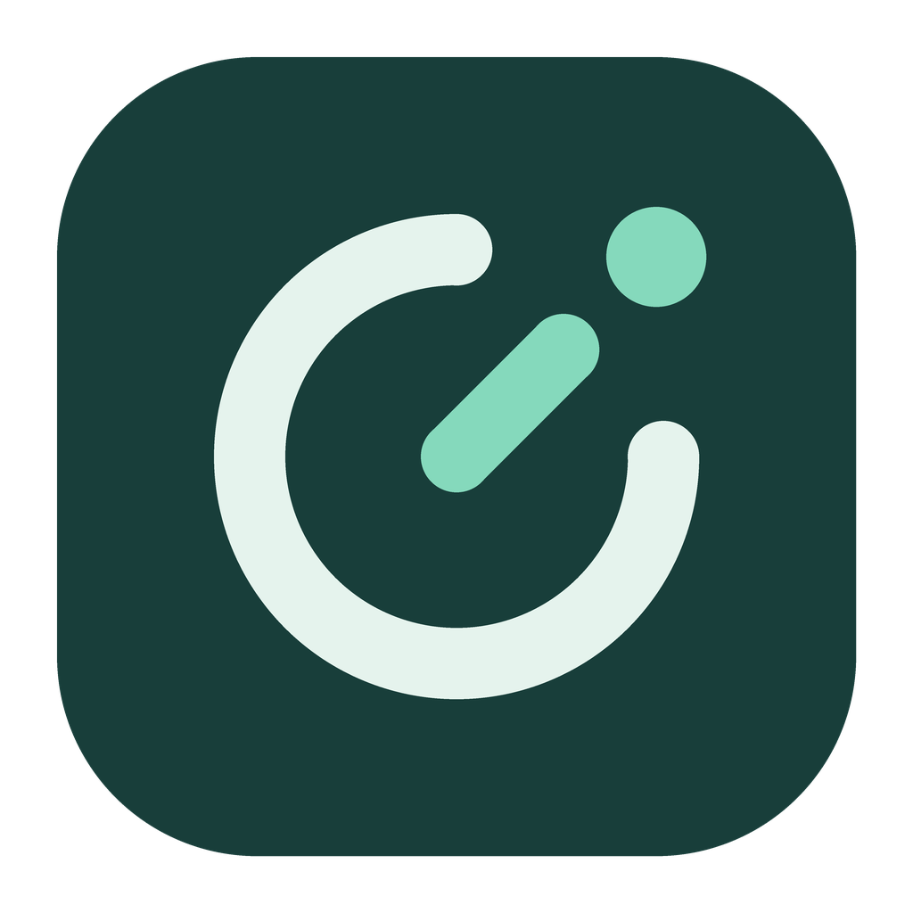
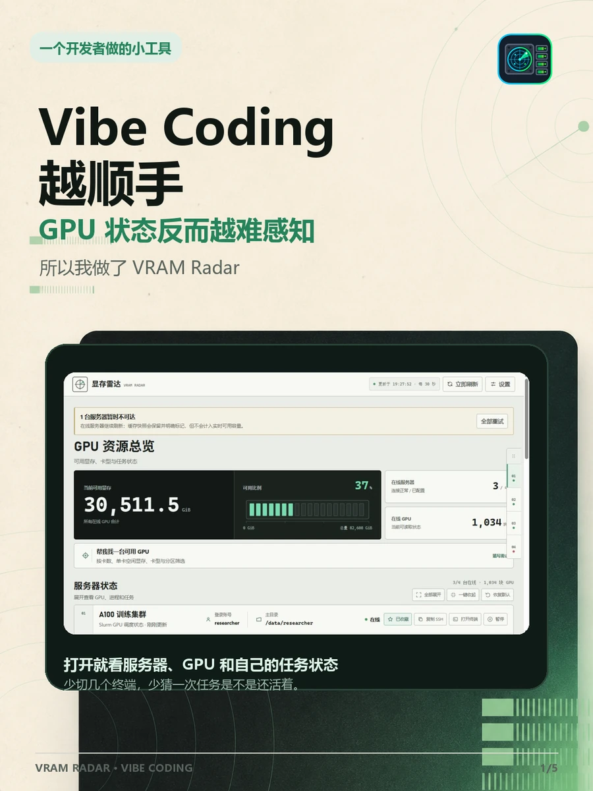
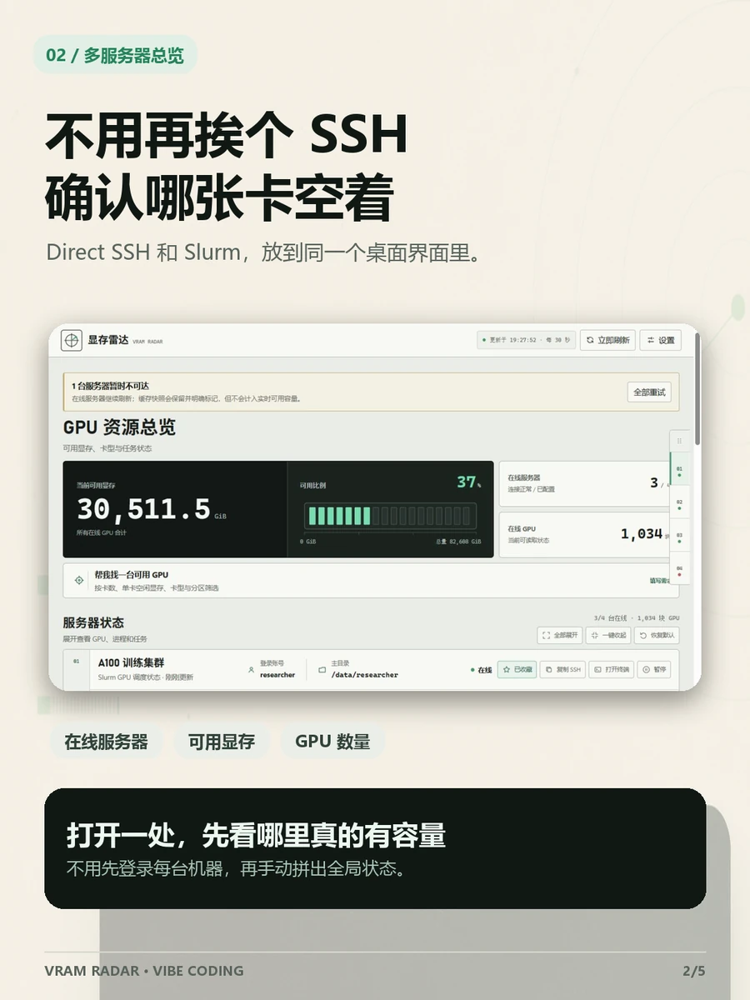
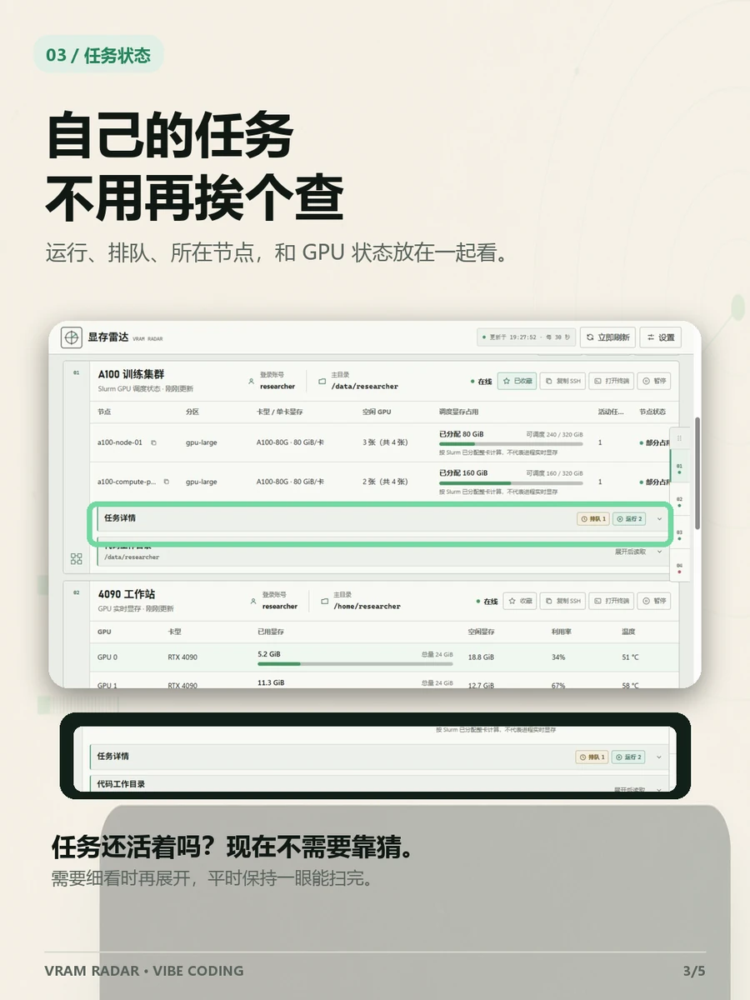
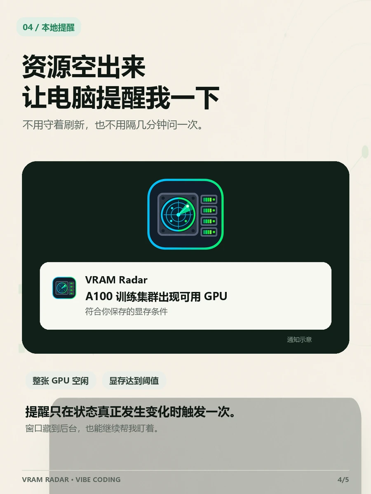
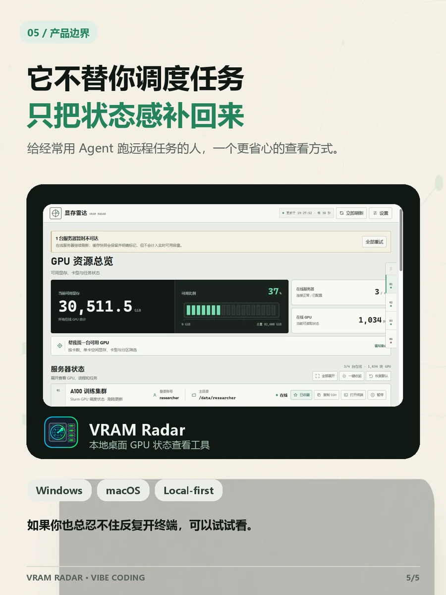

<p align="center">
  <a href="README.md">English</a> · <strong>简体中文</strong>
</p>

<p align="center">
  
</p>

<h1 align="center">VRAM Radar · 显存雷达</h1>

<p align="center">
  <strong>Vibe Coding 越顺手，也别失去对服务器状态的感知。</strong>
</p>

<p align="center">
  一个本地桌面界面，看清多台 SSH 服务器与 Slurm 集群里的 GPU、任务和连接状态。
</p>

<p align="center">
  
  
  
  
  
</p>

<p align="center">
  <a href="../../releases/latest"><strong>下载正式版</strong></a>
  · <a href="#3-分钟开始使用">快速开始</a>
  · <a href="#三个最常用的能力">核心功能</a>
  · <a href="docs/server-config-discovery.md">SSH 配置教程</a>
</p>

<p align="center">
  
</p>

## 为什么做这个工具

现在很多开发流程已经变成直接用自然语言驱动代码和任务执行。Agent 可以改代码、跑命令、启动长任务，我们不必一直守着终端。

但一个很现实的问题也冒出来了：**代码流程更省心，服务器状态反而更难感知。**

- 任务到底还在不在跑？
- 跑在哪台服务器、哪张 GPU 上？
- 什么时候会有真正可用的显存？

VRAM Radar 想补回的就是这层“状态感”。它把 Direct SSH 与 Slurm 里的容量、当前账号任务和连接状态放到同一个本地桌面界面里，需要时还能在资源满足条件时提醒一次。

## 三个最常用的能力

<table>
  <tr>
    <td width="33%"></td>
    <td width="33%"></td>
    <td width="33%"></td>
  </tr>
  <tr>
    <td><strong>一个界面看多台服务器</strong><br>Direct SSH 工作站和 Slurm 集群不再分散在不同终端。</td>
    <td><strong>任务状态与 GPU 放在一起</strong><br>查看当前账号的运行、排队、节点和资源状态。</td>
    <td><strong>资源可用时提醒一次</strong><br>保存卡型、数量或显存条件，不需要一直手动刷新。</td>
  </tr>
</table>

服务器总览优先展示可用显存和连接状态；节点、任务、进程、资源匹配和代码目录在需要时再展开。图中的服务器数据均为合成示例，不包含真实地址、账号、密钥或本地 Profile。

<p align="center">
  
</p>

VRAM Radar 不提交任务、不预约 GPU，也不替代 `nvidia-smi`、`nvtop` 或 Slurm。它解决的是更靠前的判断：**哪里有容量、我的任务在哪里、下一步应该打开哪台服务器。**

## 3 分钟开始使用

1. 从 [Latest Release](../../releases/latest) 下载与你的平台对应的正式包。
2. 启动 VRAM Radar，检查它在本机发现的 SSH 别名。
3. 确认每台服务器使用 Direct SSH 还是 Slurm，保存 Profile 后进入资源总览。

自动发现覆盖常见 OpenSSH、VS Code、Cursor、Windsurf、Colima、OrbStack、XDG 与 Harness 目录。发现过程只读取本地配置；一个条目只有在保存后的连接和采集都成功后，才会显示为**监控就绪**并计入实时容量。

## 下载与首次启动边界

当前公开稳定版为 **v0.8.2**。

| 平台 | 下载文件 | 当前边界 |
|---|---|---|
| Windows x64 | `VRAMRadar-Setup-0.8.2.exe` | 按当前用户安装；目前未签名，SmartScreen 可能要求确认。 |
| macOS | `VRAMRadar-0.8.2-macos.zip` | 内含 Apple Silicon 与 Intel 两个原生应用；目前未签名、未公证，首次从 Finder 右击 **打开**。 |

Latest Release 只保留用户实际需要下载的两个文件。Windows 推荐下载安装包，原位
更新会保留开始菜单或桌面快捷方式；公开 Release 不再提供 Windows 便携 ZIP。
macOS 版本未使用 Apple Developer ID 签名、未经公证，首次启动请在 Finder 中右击
**打开**，不要关闭 Gatekeeper。

Apple Silicon 当前验证边界为 macOS 14 或更新版本，Intel x86_64 为 macOS 15 或更新版本。请勿全局关闭 SmartScreen 或 Gatekeeper。详细边界见 [Windows 安装说明](docs/windows-install-and-update.md)、[Windows 签名状态](docs/windows-code-signing.md)、[macOS 兼容性说明](docs/macos-desktop.md)和 [v0.8.2 发布说明](docs/release-notes-v0.8.2.md)。

## 本地优先，不接管你的基础设施

- Profile、缓存、日志、运行锁和服务器目录都留在当前电脑，不会进入公开安装包。
- 密码只保存在 Windows Credential Manager 或 macOS Keychain，不写入 Profile、日志、命令行参数或子进程环境。
- 首次出现的 SSH Host Key 由 OpenSSH 自动保存；已经变化的 Host Key 会继续阻止连接。
- 监控保持只读；任务提交、GPU 预约和站点策略仍由 Slurm 或现有平台负责。

需要完整实现边界时，可查看[隐私说明](PRIVACY.md)与[服务器可靠性审计](docs/server-reliability-audit-2026-08-29.md)。

## 文档

- [SSH 配置自动发现与排查](docs/server-config-discovery.md)
- [Windows 安装、通知区域与更新](docs/windows-install-and-update.md)
- [macOS 构建与兼容性](docs/macos-desktop.md)
- [产品与桌面架构](docs/productization-design.md)
- [界面设计系统](docs/design-system.md)
- [隐私说明](PRIVACY.md)

## 开发

<details>
<summary><strong>本地构建与测试</strong></summary>

Windows：

```powershell
uv sync --extra build --frozen
.\.venv\Scripts\python.exe -m unittest discover -s tests -v
node --check src\vram_radar\web\app.js
.\Build-VramRadar.ps1 -SkipSync
```

macOS：

```bash
uv sync --extra build --frozen
./.venv/bin/python -m unittest discover -s tests -v
node --check src/vram_radar/web/app.js
bash Build-VramRadar-macOS.sh --skip-sync
./.venv/bin/python tools/validate_macos_bundle.py
```

发布验证必须使用空的临时 Profile 和 `--no-auto-import`，避免接触维护者自己的服务器配置。

</details>

## 反馈与许可证

如果自动发现遗漏了某种 SSH 配置，或应用无法启动，请在 [Issues](../../issues) 中提供系统版本、应用版本和应用生成的**脱敏诊断**。不要上传密码、私钥、真实服务器地址或未经检查的完整日志。

VRAM Radar 采用 [MIT License](LICENSE) 开源。
