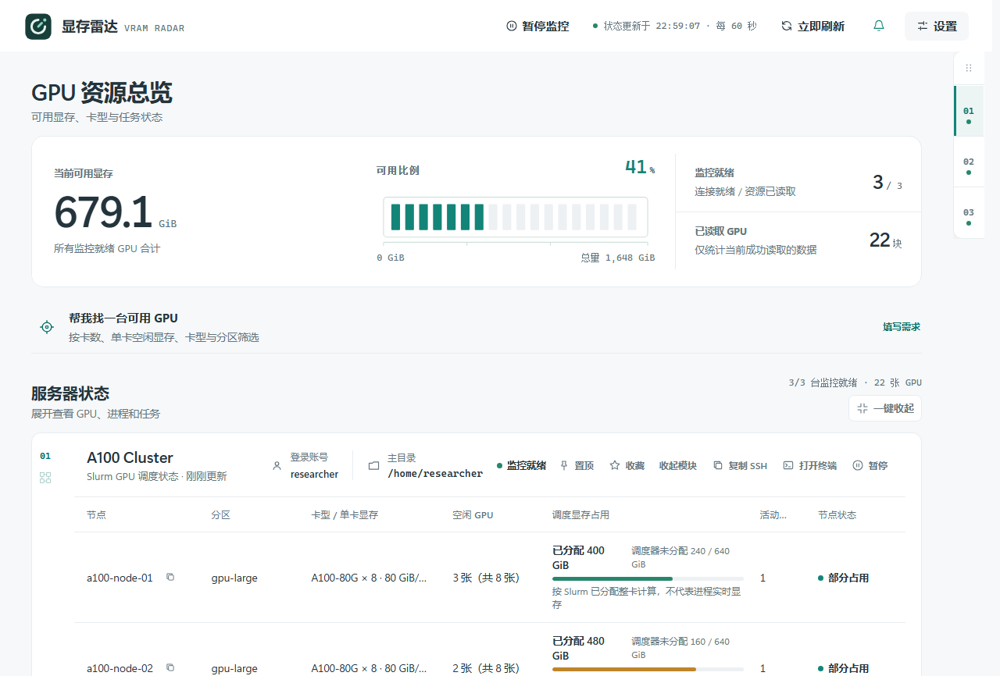
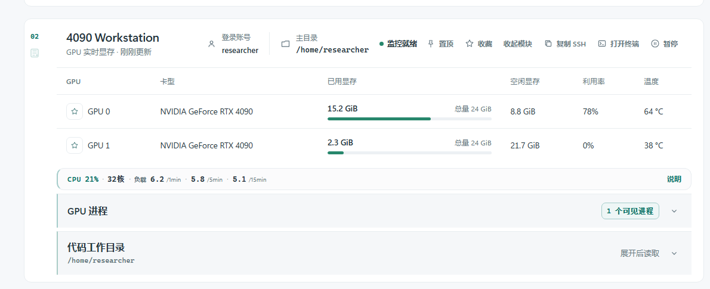
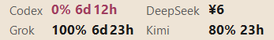
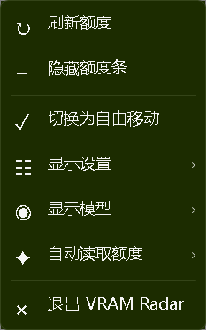

<p align="center">
  <a href="README.md">English</a> · <strong>简体中文</strong>
</p>

<p align="center">
  
</p>

<h1 align="center">VRAM Radar · 显存雷达</h1>

<p align="center">
  <strong>看清 SSH 服务器与 Slurm 集群的 GPU 余量，并在任务栏显示 AI 应用额度。</strong>
</p>

<p align="center">
  
  
  
  
  
</p>

<p align="center">
  <a href="../../releases/latest"><strong>下载 v1.0.3</strong></a>
  · <a href="#安装">安装</a>
  · <a href="#使用">使用</a>
  · <a href="#常见问题">常见问题</a>
  · <a href="docs/release-notes-v1.0.3.md">更新日志</a>
</p>



VRAM Radar 是一个本地、只读的桌面监控工具：集中显示 Direct SSH 服务器、Slurm
集群和本机 NVIDIA GPU 的可用显存、利用率、任务与连接状态。可选的任务栏额度条
（Windows）或菜单栏项（macOS）显示 AI 编程应用的剩余额度和重置时间。

它不是调度器：不提交任务、不预留 GPU，也不替代 `nvidia-smi`、`nvtop` 或 Slurm。

## 功能

### GPU 监控

| 能力 | 说明 |
|---|---|
| 多服务器 | 在同一界面查看 Direct SSH 工作站、Slurm 集群和本机的 **本地 GPU**（NVIDIA 通过 NVML 或 `nvidia-smi`；Windows 上也可通过性能计数器读取 AMD 和 Intel 显卡），支持搜索、筛选、收藏和单台暂停。 |
| 单卡详情 | 在后端提供时显示已用/空闲显存、利用率和温度；Slurm 显示分区、节点状态和调度分配。 |
| 任务与进程 | 当前账号的 Slurm 运行/排队任务和 Direct SSH GPU 进程，附带 GPU 分配和可用的计时信息。 |
| 通知 | 任务完成、收藏的服务器或 GPU 空闲/达到空闲显存阈值时发送系统通知；通知中心保留未读记录。 |
| 主机信息 | CPU 使用率、负载、核心数、内存，以及按需浏览工作目录。 |
| SSH 自动发现 | 读取本机 OpenSSH、VS Code、Cursor、Windsurf、Colima、OrbStack、XDG 等位置。发现过程只在本地进行；连接成功后服务器才算 **监控就绪**。 |



### AI 额度条（Windows 任务栏 / macOS 菜单栏）


- Windows 上，额度条位于任务栏小组件（天气）按钮右侧，跟随天气组件的可见宽度，
  并采样任务栏颜色以融入背景。
- 最多同时显示 **4** 个应用（Windows）。Codex、Grok、Kimi 显示剩余额度和距重置的
  时间；DeepSeek 显示钱包余额。Claude、GLM 智谱清言、Qwen 通义、腾讯元宝只显示安装
  和登录状态（这些应用没有可读取的本地用量数据）。默认选中 Codex；已安装的应用在本机
  自动检测。
- 名称可显示为 **图标** 或 **文字**：

  

- Codex 额度来自本机安装的 Codex `app-server`，使用其自身的 ChatGPT 登录。
  DeepSeek 通过只读查询显示钱包余额。
- **自动读取额度**（Grok、Kimi）默认关闭，需在授权对话框中允许。它复用应用已有的
  登录，只发送一次只读额度查询；登录数据仅在内存中解密，不保存、不写日志、不上传。
  之后每 5 分钟刷新。

  

- 鼠标悬停额度条约 0.4 秒可查看详情卡（图标、全名、额度／余额、重置时间与更新时间）；不抢焦点、不额外轮询。单击卡片中本机已检测到的应用所在行即可打开该应用（已在运行则切到前台）；指针所在行会高亮显示。
- macOS 菜单栏项显示 Codex 额度和重置倒计时，菜单中可查看详情、打开额度设置、刷新、
  关闭额度显示和退出。

### 通用

- 中英文双语界面；首次启动跟随系统语言，可在 **设置 → 界面语言** 中切换。
- 通过 GitHub Releases 检查更新，不会在后台自动安装：Windows 上确认 **安全一键更新**
  后，按 SHA-256 摘要和大小校验安装程序，静默安装，安装失败时恢复旧版本；macOS 上会
  在 Finder 中显示已校验的 zip。同一版本号基于更新提交重新构建的发布，会作为修复更新
  提示。

## 安装

从 [最新发布](../../releases/latest) 下载。

| 平台 | 文件 | 说明 |
|---|---|---|
| Windows x64 | `VRAMRadar-Setup-1.0.3.exe` | 按用户安装，无需管理员权限。安装程序尚未代码签名，SmartScreen 可能提示“Windows 已保护你的电脑”；确认文件来源后选择 **更多信息 → 仍要运行**。 |
| macOS | `VRAMRadar-1.0.3-macos.zip` | 包含 `VRAM Radar (Apple Silicon).app`（arm64，macOS 14+）和 `VRAM Radar (Intel).app`（x86_64，macOS 15+）。应用未使用 Apple Developer ID 签名，也未公证；首次启动请在 Finder 中右键应用并选择 **打开**。 |

请勿全局关闭 SmartScreen 或 Gatekeeper。详见
[Windows 安装与更新](docs/windows-install-and-update.md)、
[Windows 签名状态](docs/windows-code-signing.md) 和
[macOS 说明](docs/macos-desktop.md)。

## 使用

1. 启动 VRAM Radar，检查自动发现的 SSH 别名。
2. 确认每台服务器是 Direct SSH 还是 Slurm，保存后打开资源视图。监控本机时，添加
   服务器并将连接类型选为 **本地 GPU（NVIDIA / AMD / Intel）**。
3. 在 **设置** 中选择任务完成和收藏 GPU 的通知。
4. 显示 AI 额度：打开 **设置 → 扩展功能**，开启 **额度监控**。这是所有 AI 应用共用的总开关；显示哪些应用可在额度条右键菜单中选择。

### 任务栏额度条

- **单击**：打开 GPU 总览窗口。
- **双击**：打开设置中的额度监控开关。
- **右键** 菜单：



| 菜单项 | 作用 |
|---|---|
| 刷新额度 | 立即重新读取所有已选应用。 |
| 隐藏额度条 | 关闭额度条并打开设置（可在扩展功能中重新开启）。 |
| 切换为自由移动 / 固定到任务栏 | 让额度条脱离任务栏自由拖动，或放回任务栏。 |
| 显示设置 | **背景**：透明（无背景）、与任务栏同色、深色半透明胶囊、浅色胶囊、主题色调。**名称显示**：文字或图标。 |
| 显示模型 | 最多选择 4 个应用；**重新检测** 重新扫描已安装的应用。 |
| 自动读取额度 | 按应用允许或撤销自动读取（只读，不保存登录）。 |
| 退出 VRAM Radar | 退出程序。 |

## 配置

- 配置、偏好、缓存和日志按用户保存在系统的应用数据目录中。运行
  `VRAMRadar.exe --show-paths` 可打印具体位置。
- 密码只保存在 Windows 凭据管理器或 macOS 钥匙串中；SSH 私钥保留在你选择的路径。
- 命令行参数：`--profile`、`--home`（替代存储根目录）、`--servers-config`（导入并
  同步 `servers.toml`）、`--once`（不启动界面，输出一次 JSON 快照）、`--show-paths`、
  `--debug`。
- 额度条设置（已选应用、名称显示、背景、位置、授权）保存在配置中；额度数值只保存在内存中。

## 隐私

- 没有统计分析、广告、崩溃上传或账号系统。
- 网络访问仅限于你配置的 SSH 服务器、用于更新的 GitHub Releases，以及开启后所选
  AI 应用的额度服务。
- 服务器地址、凭据、GPU 状态和日志不会发送到任何 VRAM Radar 服务。监控全程只读。

详见 [PRIVACY.md](PRIVACY.md) 和 [AI 应用支持说明](docs/ai-app-providers.md)。

## 常见问题

| 现象 | 检查项 |
|---|---|
| 服务器未监控就绪 | 卡片会区分网络、认证、配置和资源读取错误。先确认终端中 `ssh <别名>` 可用，再点 **重新验证**。 |
| 额度条不显示 | 开启 **设置 → 扩展功能 → 额度监控**。如果移动过位置，选择 **固定到任务栏**。 |
| 某个应用没有额度 | 确认应用已安装并登录，使用 **显示模型 → 重新检测**；Grok、Kimi 需允许 **自动读取额度**。 |
| SmartScreen 或 Gatekeeper 阻止启动 | 见 [安装](#安装)。 |
| 反馈问题 | 使用 **复制诊断信息**（本地脱敏），在 [Issues](../../issues) 中附上系统和应用版本。不要上传密码、私钥或真实服务器地址。 |

截图中的服务器数据为示例数据；任务栏额度条截自真实的 Windows 11 任务栏。

## 从源码构建

需要 Python 与 [uv](https://docs.astral.sh/uv/)，以及 Node.js。

Windows：

```powershell
uv sync --extra build --frozen
.\.venv\Scripts\python.exe -m unittest discover -s tests -v
node --check src\vram_radar\web\app.js
node --check src\vram_radar\web\localization.js
.\.venv\Scripts\python.exe tools\validate_usage_surface.py
.\Build-VramRadar.ps1 -SkipSync
.\.venv\Scripts\python.exe tools\validate_packaged_tray.py
```

macOS：

```bash
uv sync --extra build --frozen
./.venv/bin/python -m unittest discover -s tests -v
node --check src/vram_radar/web/app.js
./.venv/bin/python tools/validate_usage_surface.py
bash Build-VramRadar-macOS.sh --skip-sync
./.venv/bin/python tools/validate_macos_bundle.py
```

发布验证请使用空的临时配置（`--home`、`--profile`、`--no-auto-import`），避免连接真实服务器。

## 文档

- [更新日志：v1.0.3 发布说明](docs/release-notes-v1.0.3.md) · [v1.0.0](docs/release-notes-v1.0.0.md)
- [SSH 配置发现](docs/server-config-discovery.md)
- [额度监控](docs/subscription-usage.md) · [AI 应用支持说明](docs/ai-app-providers.md)
- [Windows 安装与更新](docs/windows-install-and-update.md) · [macOS](docs/macos-desktop.md)
- [产品与架构说明](docs/productization-design.md) · [设计规范](docs/design-system.md)

## 许可

[MIT](LICENSE)
